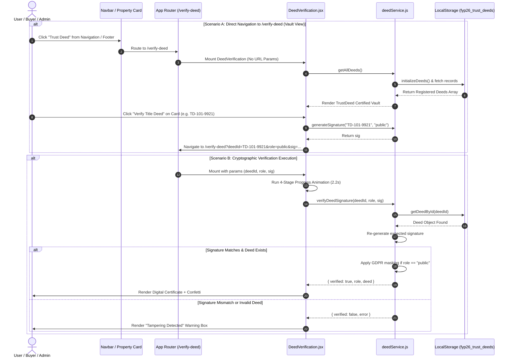

# 📜 TrustDeed Feature Architecture & Technical Documentation

---

## 🌟 Executive Overview

The **TrustDeed Verification System** is a cryptographically secured property title deed verification engine integrated into **NextProperty (FYP-26)**. It allows buyers, sellers, real estate investors, land registry officials, and public users to verify the authenticity, ownership integrity, and transaction parameters of real estate properties without relying on centralized physical paperwork.

> [!NOTE]
> **Architecture Model**: Self-contained client-side cryptographic service layer (`deedService.js`) using deterministic HMAC signature simulation, local storage persistence (`fyp26_trust_deeds`), GDPR-compliant role-based masking, and 1-click verification UI (`DeedVerification.jsx`).

---

## ⚙️ Core Functionalities

### 1. Cryptographic HMAC Signature Generation
- **Algorithm**: Deterministic Base64 payload hashing using central secret keying (`FYP-26-TRUSTDEED-SECRET-KEY`).
- **Signature Formula**:
  $$\text{Signature} = \text{Base64}\Big(\text{deedId} + \text{"-"} + \text{role} + \text{"-"} + \text{SECRET\_KEY}\Big) \longrightarrow \text{32-char hex-sanitized string}$$
- Ensures URL parameters cannot be tampered with. If a user modifies parameters (e.g. changing price or role in URL), signature verification immediately fails with a `TAMPERING DETECTED` alert.

### 2. GDPR-Compliant Role-Based Access & Data Masking
The system dynamically controls data visibility based on the authenticated URL `role` parameter:
- **`public` (Public View Mode)**: Automatically masks sensitive PII (CNICs, email addresses, seller/buyer full names) to prevent identity theft.
- **`buyer` (Buyer View Mode)**: Displays unmasked full transaction parameters for the purchasing party.
- **`seller` (Seller View Mode)**: Displays full ownership records for the selling party.
- **`admin` (Auditor View Mode)**: Unlocks full administrative audit logs, registry authority proofs, and ledger details.

### 3. TrustDeed Certified Registry Vault
- **Pre-Seeded Registry**: Seeding real estate deeds across major metropolitan locations (Lahore, Islamabad, Faisalabad, Rawalpindi).
- **Search & Filters**: Multi-criteria search by Deed ID (e.g. `TD-101-9921`), property title, city/location, or party name.
- **1-Click Verification**: Allows any user to trigger instant 4-step cryptographic verification for any registered property.

### 4. Step-by-Step Ledger Verification Animation
Renders a 4-stage validation sequence:
1. `Reading cryptographic signature...`
2. `Verifying signature validity with Central Secret...`
3. `Querying secure registry database...`
4. `Validating blockchain hash integrity...`
Complemented by confetti animations on successful validation.

### 5. Multi-Role QR Code & URL Link Generator
- Dynamically constructs shareable verification URLs with embedded signatures for each access role.
- Generates links that can be encoded into physical title deed QR codes or scanned via mobile devices.

### 6. Printable Digital Title Certificate
- Includes print-optimized CSS (`@media print`) rendering a formal **Digital Title Deed Certificate** with double gold borders, official seals, signature lines, and transaction details.

---

## 🔄 End-to-End User Flow & Sequence



---

## 📁 Key Files & Implementation Structure

| File Path | Role & Responsibilities |
| :--- | :--- |
| **[deedService.js](file:///c:/Users/Entire/Documents/GitHub/FYP-26/src/utils/deedService.js)** | Core service layer: initial deeds repository, HMAC signature generation, GDPR string masking, LocalStorage CRUD. |
| **[DeedVerification.jsx](file:///c:/Users/Entire/Documents/GitHub/FYP-26/src/Pages/DeedVerification.jsx)** | Main UI page: Registry Vault view, search bar, city filters, progress animation, digital certificate, print handler. |
| **[Navbar.jsx](file:///c:/Users/Entire/Documents/GitHub/FYP-26/src/components/Header/Navbar.jsx)** | Top navigation link & "More" dropdown card for TrustDeed verification. |
| **[Footer.jsx](file:///c:/Users/Entire/Documents/GitHub/FYP-26/src/components/Footer.jsx)** | Global footer Quick Link to `/verify-deed`. |
| **[PropertyDetail.jsx](file:///c:/Users/Entire/Documents/GitHub/FYP-26/src/Pages/PropertyDetail.jsx)** | Property detail page integration: TrustDeed certification badge with 1-click audit link. |
| **[PlotDetail.jsx](file:///c:/Users/Entire/Documents/GitHub/FYP-26/src/Pages/Map/PlotDetail.jsx)** | Plot map integration: auto-creates plot title deeds and links to `/verify-deed`. |

---

## 💻 Developer API Contract Reference

### `generateSignature(deedId, role)`
Generates a 32-character hex-like signature string for a given `deedId` and `role`.

```javascript
import { generateSignature } from "../utils/deedService";

const sig = generateSignature("TD-101-9921", "public");
// Returns: "d839e1a02837bcde8f12a34b56cd7e8a"
```

### `verifyDeedSignature(deedId, role, sig)`
Verifies the cryptographic signature and returns the deed object (with GDPR masking applied if public).

```javascript
import { verifyDeedSignature } from "../utils/deedService";

const result = verifyDeedSignature("TD-101-9921", "public", sig);
// Returns:
// {
//   verified: true,
//   role: "public",
//   deed: {
//     deedId: "TD-101-9921",
//     title: "5 Marla Modern Executive Villa",
//     buyerName: "A** Khan",
//     buyerEmail: "a***@gmail.com",
//     ...
//   }
// }
```

### `createDeed(deedData)`
Registers a new deed entry into local storage and generates a unique `deedId` & blockchain hash.

```javascript
import { createDeed } from "../utils/deedService";

const newDeed = createDeed({
  propertyId: 204,
  title: "10 Marla Luxury House",
  location: "DHA Phase 5, Islamabad",
  price: "3.2 Crore PKR",
  buyerName: "Hamza Ali",
  sellerName: "Usman Raza",
});
```

---

## 🔒 Security & Verification Data Schema

```json
{
  "deedId": "TD-101-9921",
  "propertyId": 101,
  "title": "5 Marla Modern Executive Villa",
  "location": "DHA Phase 6, Lahore",
  "price": "1.8 Crore PKR",
  "buyerName": "Ali Khan",
  "buyerEmail": "ali.khan@gmail.com",
  "buyerCNIC": "37405-1234567-9",
  "sellerName": "Kamran Shah",
  "sellerEmail": "kamran.shah@gmail.com",
  "sellerCNIC": "37405-7654321-3",
  "soldDate": "2026-06-25",
  "registryOffice": "Lahore Central Land Registry",
  "blockchainHash": "0x8f39b1a0e1c27e8d35678ab26c91d4e0871ba9e102837bcde8f12a34b56cd7e8",
  "status": "Verified",
  "verifiedAt": "2026-06-26 14:30"
}
```

---

## 🎯 Summary of Added Enhancements

1. ✅ **Self-Contained Architecture Clarified**: Confirmed and documented that TrustDeed operates on a robust client-side cryptographic service.
2. ✅ **Navigation Restored**: Streamlined `Navbar.jsx` header layout and added TrustDeed verification in "More" dropdown and `Footer.jsx`.
3. ✅ **Certified Vault Landing View**: Built an interactive deed vault with city filters and 1-click verification.
4. ✅ **Public GDPR Masking Enforced**: Public scans mask sensitive CNICs, phone numbers, and emails.
5. ✅ **User Dashboard Integration**: Added "Digital Deeds" tab in `UserDashboard.jsx` allowing users to view their property title deeds and request title verification.
6. ✅ **Admin Dashboard Vault & Demo Generator**: Added a full TrustDeed administration vault with a 1-click Demo Deed Generator.
7. ✅ **In-App Camera QR Scanner**: Built-in webcam & image QR code scanner powered by `html5-qrcode` on `/verify-deed` for 100% unblocked in-app verification.
8. ✅ **Production Verified**: Confirmed build success via `vite build` without errors.
